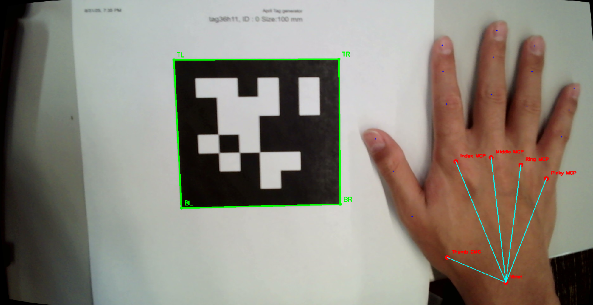

## AprilTag Robot Control in Isaac Sim

This project implements real-time AprilTag and hand detection to control the Franka Panda arm in NVIDIA Isaac Sim. It uses a webcam to track an AprilTag and hand, translates the 3D pose information into a cube in sim, and an absolute inverse kinematics controller to control the Franka's end-effector.


## Technical Architecture

1. **CameraStream Class** (`camera_stream.py`)
   - Manages threaded webcam capture and real-time processing
   - Handles camera calibration loading and frame undistortion
   - Integrates AprilTagTracker and HandPoseDetector for simultaneous detection

2. **AprilTagTracker Class** (`apriltag_tracker.py`)
   - Manages webcam input and AprilTag detection
   - Handles camera calibration loading and undistortion
   - Estimates 3D pose (rotation and translation) of detected tags

3. **HandPoseDetector Class** (`hand_pose.py`)
   - Takes measurements.json file from hand calibration for hand size
   - Uses mediapipe's detection model to find 21 distinct points on hand
   - Uses mediapipe's 2D and relative 3D coordinates and OpenCV's solvePnP function to get the real 3D world coordinates
   

4. **Robot Control in Simulation** (`track_cube.py`)
   - Integrates AprilTag data in Isaac Sim
   - Uses [Isaac-Lift-Cube-Franka-IK-Abs-v0 environment](https://github.com/isaac-sim/IsaacLab/blob/main/source/isaaclab_tasks/isaaclab_tasks/manager_based/manipulation/lift/config/franka/ik_abs_env_cfg.py)
   - Maps camera coordinates to cube and arm in simulation world coordinates
   - Uses absolute inverse kinematics to control Franka arm

## Installation

1. **Activate Isaac Lab Environment**

This varies by installation method, follow [NVIDIA's official guide](https://isaac-sim.github.io/IsaacLab/main/source/setup/installation/index.html)

2. **Install Dependencies**
```bash
pip install -r requirements.txt
```

## Usage

1. **Capture Calibration Photos**
```bash
python calibration/capture_photos.py
```
- Place an 8x6 chessboard pattern in view
- Press Enter to capture photos from different angles (recommended ~20)
- Photos saved to `./calibration/webcam/`

2. **Camera Calibration**
```bash
python calibration/camera_calibration.py
```
- Processes captured photos to compute camera intrinsics
- Calibration data saved to `./calibration/webcam/calib.npz`

3. **Hand Measurement**
```bash
python calibration/hand_measurement.py <image_path> <tag_size_meters>
```
- Capture one image with your palm flat on the same plane as an AprilTag
- Example: `python calibration/hand_measurement.py calibration/hand/calib.jpg 0.04`
- Generates personalized hand measurements in `./calibration/hand/measurements.json`

4. **Full Simulation**
```bash
python track_cube.py --tag_size=[TAG_SIZE]
```
- Launches Isaac Sim with robot control, make sure to specify tag_size
- Robot arm tracks AprilTag and hand movement using IK controller
